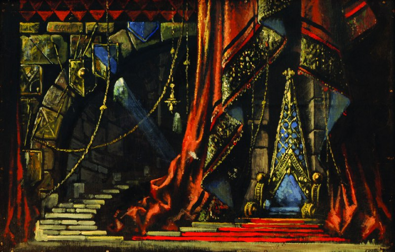

+++
title = ""
date = 2025-08-06T18:48:06+00:00
description = "Imagine a 2d side-scroll quest-action game with such visual style Decoration sketch for the play 'King Lear' (1948) by Sergo Kobuladze Georgian State Museum of Theatre, Music, Film and Choreography -…"

[taxonomies]
days = ["2025-08-06"]
tags = ["games", "art", "sergo_kobuladze", "sakartvelo"]

[extra]
id = 617
day = "2025-08-06"
tg_url = "https://t.me/vitaly_zdanevich_chan/617"
og_image = "5233728241192268441_1218572315_456258201.jpg"
next_id = 618
next_title = ""
prev_id = 616
prev_title = ""
views = 38
ids = [617]
+++

Imagine a 2d side-scroll quest-action game with such visual style

> Decoration sketch for the play 'King Lear' (1948) by Sergo Kobuladze Georgian State Museum of Theatre, Music, Film and Choreography - Art Palace

{{ tag(t="games") }}
{{ tag(t="art") }}
{{ tag(t="sergo_kobuladze") }} 1909 - 1978
{{ tag(t="sakartvelo") }}

[Source](https://ru.wikipedia.org/wiki/%D0%A4%D0%B0%D0%B9%D0%BB:Decoration_sketch_for_the_play_%27King_Lear%27_(1948)_by_Sergo_Kobuladze_Georgian_State_Museum_of_Theatre,_Music,_Film_and_Choreography_-_Art_Palace.jpg)

<https://artsandculture.google.com/search/asset?q=Sergo%20Kobuladze>

