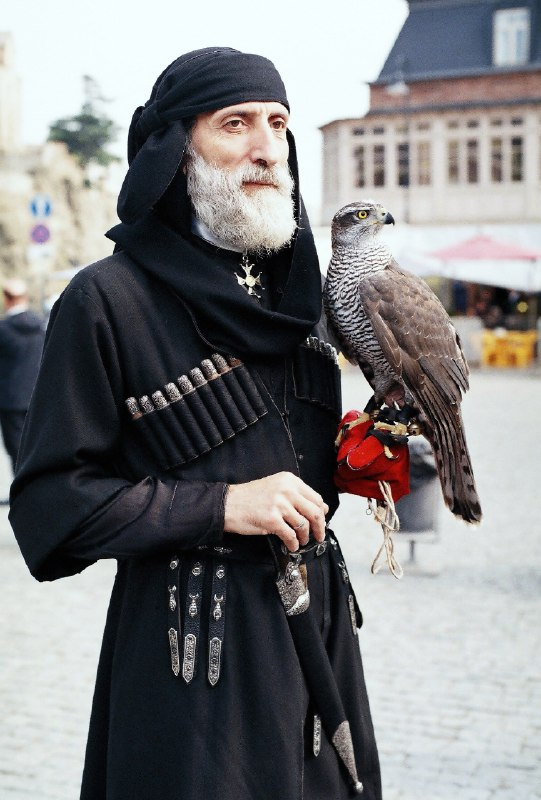

+++
title = "Georgian (604).jpg"
date = 2025-08-08T01:25:02+00:00
description = "Georgian (604).jpg Georgian man (Zaal Sikharulidze) with falcon wearing Chokha on Tbilisoba festival sakartvelo fashion chokha"

[taxonomies]
tags = ["sakartvelo", "fashion", "chokha"]

[extra]
tg_url = "https://t.me/vitaly_zdanevich_chan/618"
og_image = "5237834294351754182_1219528330_456258502.jpg"
next_id = 619
next_title = "Returned to uploading of artifacts from moneymuseum.by, through my new web extension, and again - sometime I see the beauty"
prev_id = 617
prev_title = "Imagine a 2d side-scroll quest-action game with such visual style"
views = 36
ids = [618]
+++

[Georgian (604).jpg](https://commons.wikimedia.org/wiki/File:Georgian_%28604%29.jpg)

> Georgian man (Zaal Sikharulidze) with falcon wearing Chokha on Tbilisoba festival

{{ tag(t="sakartvelo") }}
{{ tag(t="fashion") }}
{{ tag(t="chokha") }}

