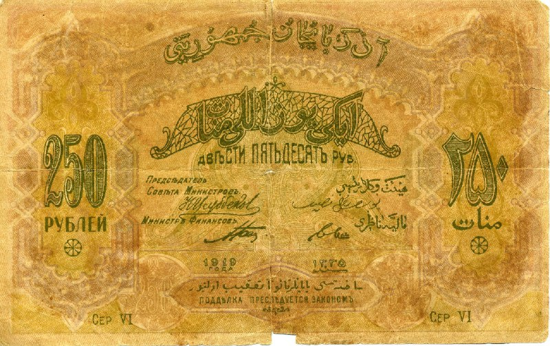

+++
title = "Returned to uploading of artifacts from moneymuseum.by, through my new web extension, and again - sometime I see the beauty"
date = 2025-08-09T04:34:07+00:00
description = "Returned to uploading of artifacts from moneymuseum.by, through my new web extension, and again - sometime I see the beauty money moneymuseum Source"

[taxonomies]
tags = ["money", "moneymuseum"]

[extra]
tg_url = "https://t.me/vitaly_zdanevich_chan/619"
og_image = "5240341610359812839_1220112110_456258279.jpg"
next_id = 620
next_title = "250 rubles banknotes"
prev_id = 618
prev_title = "Georgian (604).jpg"
views = 34
ids = [619]
+++

Returned to uploading of artifacts from [moneymuseum.by](http://moneymuseum.by/), through my [new web extension](https://gitlab.com/vitaly-zdanevich-extensions/web-extension-uploading-to-wikimedia-commons), and again - sometime I see the beauty

{{ tag(t="money") }}
{{ tag(t="moneymuseum") }}

[Source](https://commons.wikimedia.org/wiki/File:250-rouble_note_of_Russia,_Azerbaijan_1919_-_back.jpg)

