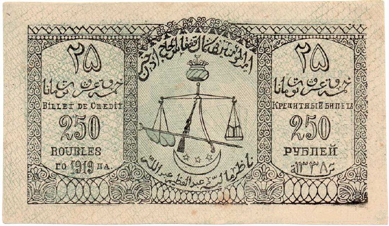

+++
title = ""
date = 2025-08-09T04:37:00+00:00
description = "money ussr design Source.png)"

[taxonomies]
days = ["2025-08-09"]
tags = ["money", "ussr", "design"]

[extra]
id = 620
day = "2025-08-09"
tg_url = "https://t.me/vitaly_zdanevich_chan/620"
og_image = "5240341610359812844_1220112110_456258284.jpg"
next_id = 621
next_title = ""
next_body = "#anime\n#gpu\nSource"
prev_id = 619
prev_title = ""
prev_body = "Returned to uploading of artifacts from moneymuseum.by, through my new web extension, and again - sometime I see the beauty\n#money\n#moneymuseum\nSource"
views = 34
ids = [620]
+++

{{ tag(t="money") }}  
{{ tag(t="ussr") }}  
{{ tag(t="design") }}  

[Source](https://commons.wikimedia.org/wiki/Category:250_rubles_banknotes#/media/File:25_%D1%82%D1%83%D0%BC%D0%B0%D0%BD_(%D0%B0%D0%B2%D0%B5%D1%80%D1%81).png)

