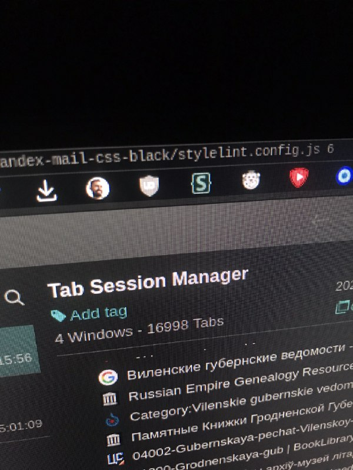

+++
title = ""
date = 2025-08-27T01:20:06+00:00

[taxonomies]
days = ["2025-08-27"]

[extra]
id = 638
day = "2025-08-27"
tg_url = "https://t.me/vitaly_zdanevich_chan/638"
og_image = "01.jpg"
next_id = 640
next_title = ""
next_body = ""
prev_id = 635
prev_title = ""
prev_body = "#gamedev\n#homm3\nI’ve told this tale numerous times as an industry ‘war story’. I don’t know if I would consider it ‘funny’. At the very least, most might consider it ‘amusing’. We were crunching on HOMM III. I was already putting in 9 and 10 hour days before crunch began. At some point, I began to wonder exactly how many hours I was working, and with my salary, what I was making per hour. So, I began tracking when I arrived and departed from work. After I had accumulated over 300 hours of overtime... I did the math. In the year 1998, I was making about $5 an hour. With this number in my head, I needed a break, so I left my desk, and drove to McDonalds for a quick dinner. I was waiting in line, looking at the young lady who was about to take my order, when it dawned on me. On a per hour basis, she was probably making more money than I was. Something to think about for anyone wanting to get into video game development.\nSource"
views = 29
ids = [638]
+++

