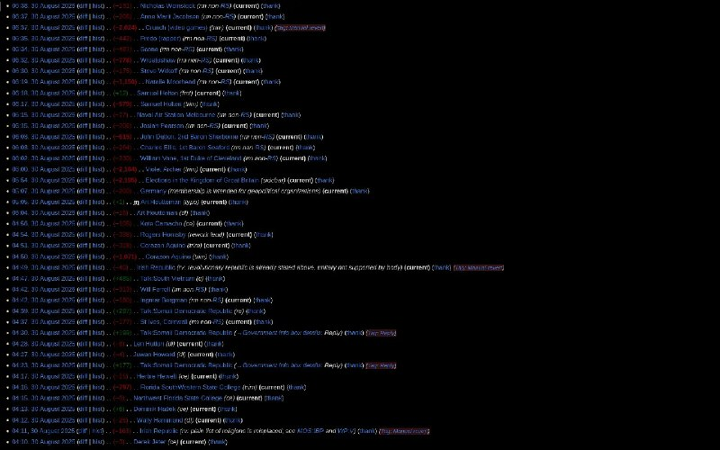

+++
title = ""
date = 2025-08-30T03:58:06+00:00
description = "Someones contributions to wikipedia delitism"

[taxonomies]
days = ["2025-08-30"]
tags = ["wikipedia", "delitism"]

[extra]
id = 645
day = "2025-08-30"
tg_url = "https://t.me/vitaly_zdanevich_chan/645"
og_image = "5301208284855926733_1234283737_456261581.jpg"
next_id = 646
next_title = ""
prev_id = 644
prev_title = ""
views = 35
ids = [645]
+++

Someones contributions to {{ tag(t="wikipedia") }}

{{ tag(t="delitism") }}

