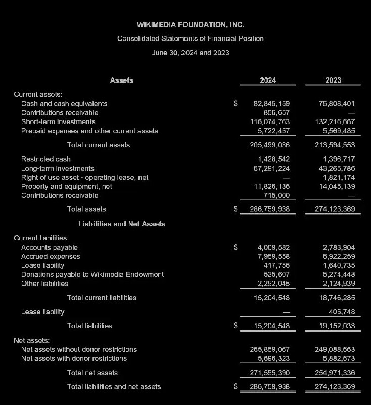

+++
title = ""
date = 2025-09-01T10:22:35+00:00
description = "wikimediafoundation money Source Source"

[taxonomies]
days = ["2025-09-01"]
tags = ["wikimedia_foundation", "money"]

[extra]
id = 652
day = "2025-09-01"
tg_url = "https://t.me/vitaly_zdanevich_chan/652"
og_image = "5307862000946249677_1235832926_456261581.jpg"
next_id = 653
next_title = ""
prev_id = 651
prev_title = ""
views = 34
ids = [652]
+++

{{ tag(t="wikimedia_foundation") }}
{{ tag(t="money") }}

[Source](https://upload.wikimedia.org/wikipedia/foundation/f/f6/Wikimedia_Foundation_2024_Audited_Financial_Statements.pdf)
[Source](https://en.wikipedia.org/wiki/Wikimedia_Foundation)

