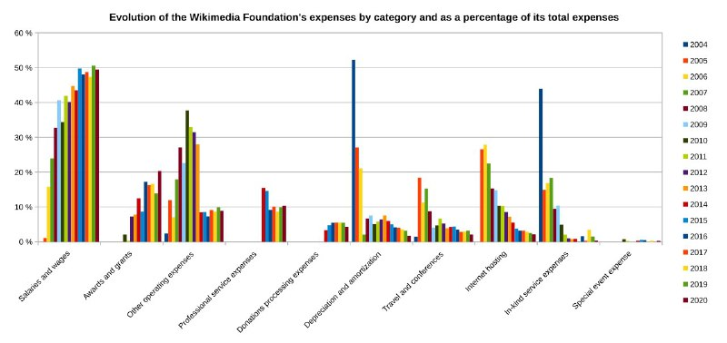

+++
title = ""
date = 2025-09-01T10:24:23+00:00
description = "wikimediafoundation money Source"

[taxonomies]
days = ["2025-09-01"]
tags = ["wikimedia_foundation", "money"]

[extra]
id = 653
day = "2025-09-01"
tg_url = "https://t.me/vitaly_zdanevich_chan/653"
og_image = "5307778803134757101_1235813555_456259821.jpg"
next_id = 654
next_title = ""
next_body = "#russia\n#israel\n#map\nSource"
prev_id = 652
prev_title = ""
prev_body = "#wikimediafoundation\n#money\nSource\nSource"
views = 37
ids = [653]
+++

{{ tag(t="wikimedia_foundation") }}  
{{ tag(t="money") }}  

[Source](https://en.wikipedia.org/wiki/Wikimedia_Foundation)

