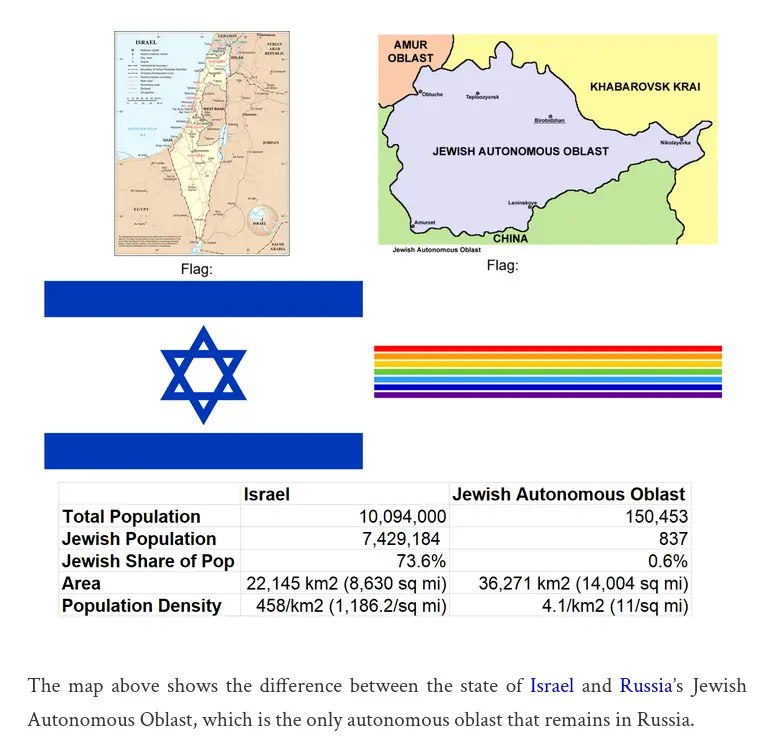

+++
title = ""
date = 2025-09-01T10:47:32+00:00
description = "russia israel map Source"

[taxonomies]
days = ["2025-09-01"]
tags = ["russia", "israel", "map"]

[extra]
id = 654
day = "2025-09-01"
tg_url = "https://t.me/vitaly_zdanevich_chan/654"
og_image = "5307778803134757166_1235813555_456259886.jpg"
next_id = 655
next_title = ""
next_body = "#chatgpt 5:\nEscape shell $ as $$ inside Makefile recipes\n#gemini:\nNo, you should not use RESP=$$() for command substitution. Your original syntax was correct."
prev_id = 653
prev_title = ""
prev_body = "#wikimediafoundation\n#money\nSource"
views = 37
ids = [654]
+++

{{ tag(t="russia") }}  
{{ tag(t="israel") }}  
{{ tag(t="map") }}  

[Source](https://brilliantmaps.com/israel-vs-jewish-autonomous-oblast/#more-21064)  

<https://en.wikipedia.org/wiki/Jewish_Autonomous_Oblast>

