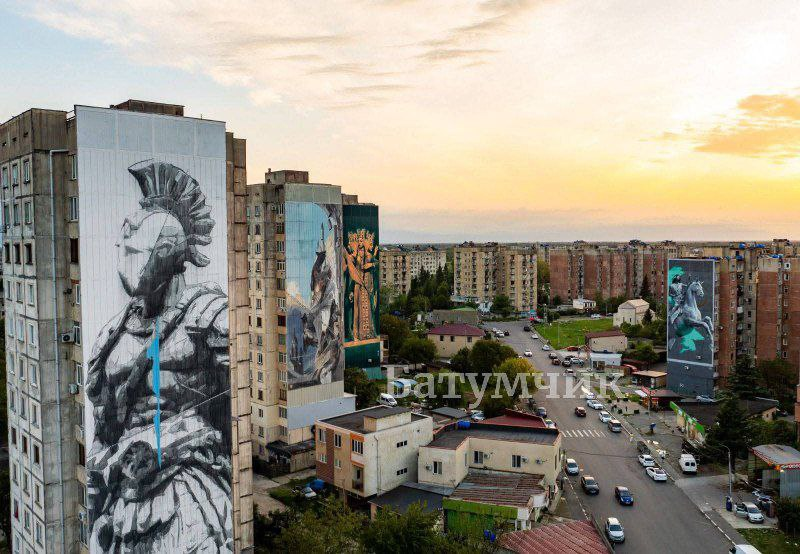
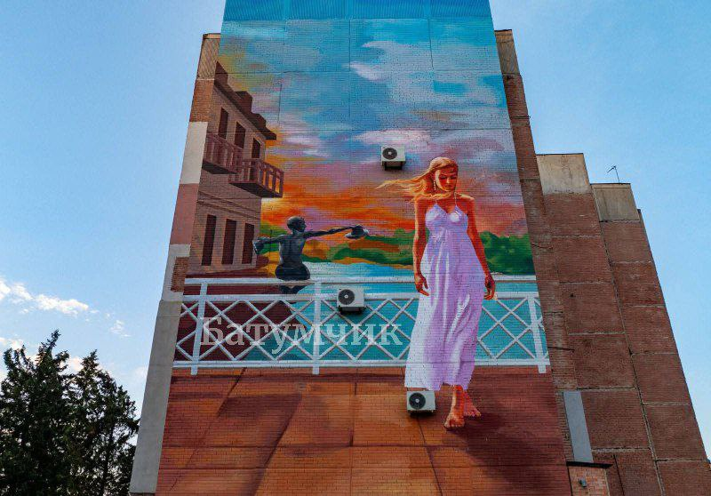
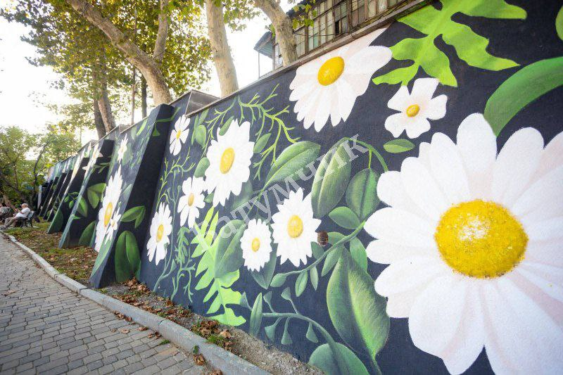
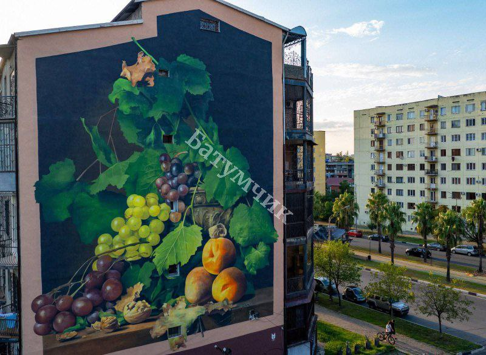
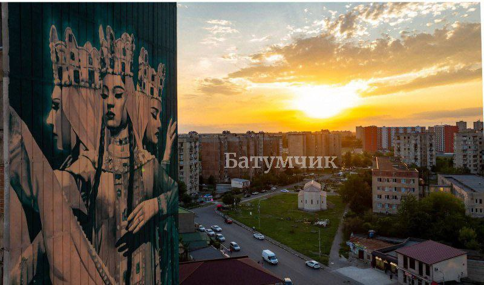
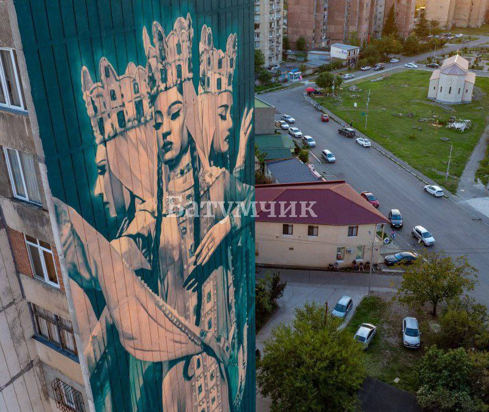
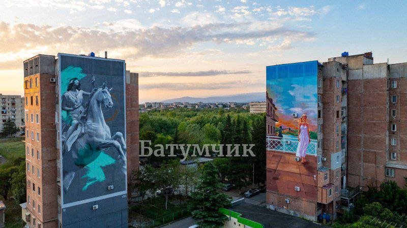

+++
title = "В Кутаиси продолжается проект «Mural Fest» 🎨"
date = 2025-09-09T13:02:17+00:00
description = "В муниципалитете активно проходит роспись стен. Проект реализуется с 2023 года по инициативе Службы культуры, спорта, образования и молодежи при поддержке мэрии города. За это время уже расписано…"

[extra]
tg_url = "https://t.me/vitaly_zdanevich_chan/658"
og_image = "01.jpg"
next_id = 665
next_title = "Night Watch"
prev_id = 657
prev_title = "const s = \"สวัสดี\""
views = 29
forwarded_from = "Батумчик 🌴 | Новости Батуми | Западная Грузия"
forwarded_from_url = "https://t.me/batumchik/65094"
ids = [658]
+++

В муниципалитете активно проходит роспись стен. Проект реализуется с 2023 года по инициативе Службы культуры, спорта, образования и молодежи при поддержке мэрии города.

За это время уже расписано более 15 стен при участии известных художников.

**➡️** В этом году, в рамках фестиваля, ставшего уже традицией, были оформлены ещё 4 стены. Муралы органично вписываются в архитектурную среду и туристические маршруты, охватывая:

**➡️**элементы фольклора,

**➡️**литературные мотивы,

**➡️**стилизованный флоральный арт и

**➡️**натюрморт.

**👉** Цель проекта — разнообразить визуальный облик города и укрепить культурную атмосферу.

