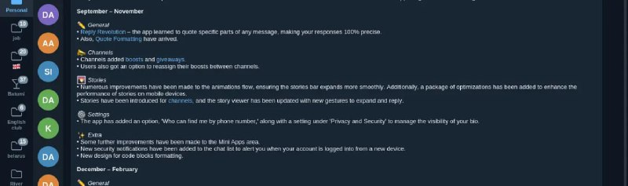

+++
title = ""
date = 2025-09-20T09:37:11+00:00
description = "telegram with wide messages"

[taxonomies]
days = ["2025-09-20"]
tags = ["telegram"]

[extra]
id = 674
day = "2025-09-20"
tg_url = "https://t.me/vitaly_zdanevich_chan/674"
og_image = "5364201410545194447_1248950467_456267215.jpg"
next_id = 675
next_title = ""
next_body = "#smell\n#dating\nSource"
prev_id = 673
prev_title = ""
prev_body = "#mem\n#memit\n#kubernetes\n#art\n#monalisa\n#sexy\nKubernetes in my day-to-day life VS how it was sold to me"
views = 23
ids = [674]
+++

{{ tag(t="telegram") }} with wide messages <https://github.com/kotatogram/kotatogram-desktop>

