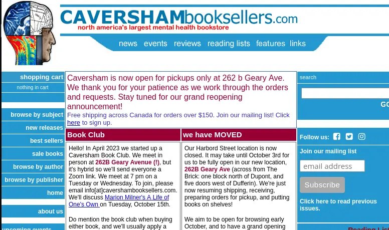

+++
title = ""
date = 2025-09-28T17:59:26+00:00
description = "Love this logo head psy"

[taxonomies]
days = ["2025-09-28"]
tags = ["logo", "head", "psy"]

[extra]
id = 683
day = "2025-09-28"
tg_url = "https://t.me/vitaly_zdanevich_chan/683"
og_image = "5388950214695584492_1254712747_456262380.jpg"
next_id = 684
next_title = ""
next_body = "#patch for #telegram for wide messages\n--- a/Telegram/SourceFiles/ui/chat/chat.style 2024-08-02 09:26:52.899323105 +0700\n+++ b/Telegram/SourceFiles/ui/chat/chat.style 2024-08-02 09:27:23.226355858 +0700\n@@ -11,7 +11,7 @@ using \"ui/widgets/widgets.style\";\nusing \"ui/menuicons.style\";\nusing \"chathelpers/chathelpers.style\"; // GroupCallUserpics\n-msgMaxWidth: 430px;\n+msgMaxWidth: 2430px;\nmsgFont: font(fsize);\nmsgNameFont: semiboldFont;\nmsgNameStyle: semiboldTextStyle;"
prev_id = 681
prev_title = ""
prev_body = "#coin\n#belarus\n#history\nUploaded to"
views = 23
ids = [683]
+++

Love this {{ tag(t="logo") }}  
{{ tag(t="head") }}  
{{ tag(t="psy") }}  

<https://www.cavershambooksellers.com/home>

