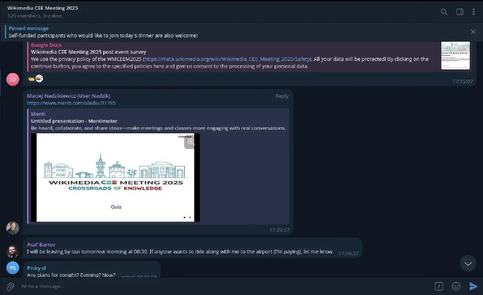

+++
title = "patch for telegram for wide messages"
date = 2025-09-29T05:52:05+00:00
description = "patch for telegram for wide messages --- a/Telegram/SourceFiles/ui/chat/chat.style 2024-08-02 09:26:52.899323105 +0700 +++ b/Telegram/SourceFiles/ui/chat/chat.style 2024-08-02 09:27:23.226355858…"

[taxonomies]
tags = ["patch", "telegram"]

[extra]
tg_url = "https://t.me/vitaly_zdanevich_chan/684"
og_image = "5391335068301129921_1255268014_456259777.jpg"
next_id = 685
next_title = "fear airplane video"
prev_id = 683
prev_title = "Love this logo"
views = 22
ids = [684]
+++

{{ tag(t="patch") }} for {{ tag(t="telegram") }} for wide messages

```
--- a/Telegram/SourceFiles/ui/chat/chat.style  2024-08-02 09:26:52.899323105 +0700
+++ b/Telegram/SourceFiles/ui/chat/chat.style  2024-08-02 09:27:23.226355858 +0700
@@ -11,7 +11,7 @@ using "ui/widgets/widgets.style";
 using "ui/menu_icons.style";
 using "chat_helpers/chat_helpers.style"; // GroupCallUserpics

-msgMaxWidth: 430px;
+msgMaxWidth: 2430px;
 msgFont: font(fsize);
 msgNameFont: semiboldFont;
 msgNameStyle: semiboldTextStyle;
```

<https://github.com/msva/mva-overlay/blob/master/net-im/telegram-desktop/files/patches/0/conditional/tdesktop_patches_wide-baloons/style.patch>


