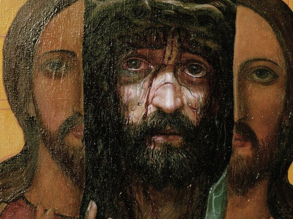

+++
title = ""
date = 2025-10-01T12:33:27+00:00
description = "Александр Исачёв, лишившись поддержки мецената, возвращается в Речицу, где 14 ноября 1987 года проходит его первая персональная выставка. Её посетило более 20 тысяч человек. Это событие стало…"

[taxonomies]
days = ["2025-10-01"]

[extra]
id = 692
day = "2025-10-01"
tg_url = "https://t.me/vitaly_zdanevich_chan/692"
og_image = "5397696958543559379_1256749257_456260307.jpg"
next_id = 693
next_title = ""
prev_id = 691
prev_title = ""
views = 35
ids = [692]
+++

> Александр Исачёв, лишившись поддержки мецената, возвращается в Речицу, где 14 ноября 1987 года проходит его **первая персональная выставка**. Её посетило более 20 тысяч человек. Это событие стало настоящей сенсацией в культурной жизни БССР. Да и сам Исачев был счастлив, что его наконец-то признали. **Через три дня он умер** от сердечного приступа, в 33 года.

> Alexander Isachev, having lost the support of the philanthropist, returns to Rechitsa, where on November 14, 1987 **his first personal exhibition** is being held. It was visited by more than 20 thousand people. This event became a real sensation in the cultural life of the BSSR. Isachev himself was happy that he was finally recognized. **Three days later, he died** of a heart attack, on 33 years.

[https://ru.wikipedia.org/wiki/Исачёв,\_Александр\_Анатольевич](https://ru.wikipedia.org/wiki/%D0%98%D1%81%D0%B0%D1%87%D1%91%D0%B2,_%D0%90%D0%BB%D0%B5%D0%BA%D1%81%D0%B0%D0%BD%D0%B4%D1%80_%D0%90%D0%BD%D0%B0%D1%82%D0%BE%D0%BB%D1%8C%D0%B5%D0%B2%D0%B8%D1%87) [Source](https://hvali.by/belorusskie-hudozhniki/aleksandr-isachev/)

