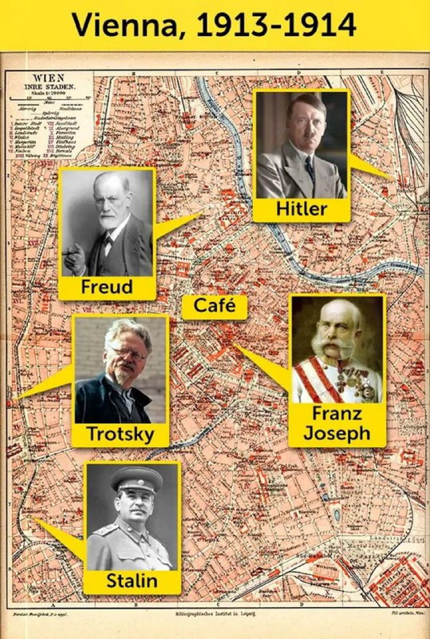

+++
title = ""
date = 2025-10-06T15:21:13+00:00
description = "hitler, stalin, trotsky, freud & Franz Joseph All Lived Within A Couple Of Miles Of Each Other On The Eve Of WW1 Source Source B"

[taxonomies]
days = ["2025-10-06"]
tags = ["hitler", "stalin", "trotsky", "freud"]

[extra]
id = 698
day = "2025-10-06"
tg_url = "https://t.me/vitaly_zdanevich_chan/698"
og_image = "5413585189327731507_1260448524_456260403.jpg"
next_id = 699
next_title = ""
prev_id = 697
prev_title = ""
views = 22
ids = [698]
+++

> {{ tag(t="hitler") }}, {{ tag(t="stalin") }}, {{ tag(t="trotsky") }}, {{ tag(t="freud") }} & Franz Joseph All Lived Within A Couple Of Miles Of Each Other On The Eve Of WW1

[Source](https://www.instagram.com/p/DPeNiP2DDW5)  
[Source B](https://brilliantmaps.com/vienna-1913-1914/)

