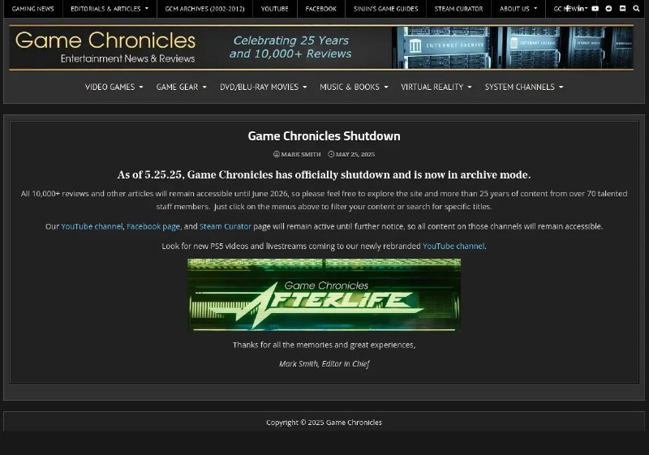

+++
title = ""
date = 2025-10-19T20:43:19+00:00
description = "archivation games Trying to zim it"

[taxonomies]
days = ["2025-10-19"]
tags = ["archivation", "games", "zim"]

[extra]
id = 707
day = "2025-10-19"
tg_url = "https://t.me/vitaly_zdanevich_chan/707"
og_image = "5452161769536621413_1269430334_456264549.jpg"
next_id = 708
next_title = ""
next_body = "#concert\n#rammstein\n#year2019\n#russia\nNot my photo."
prev_id = 706
prev_title = ""
prev_body = "#wikidata\n#linux\n#warcraft3"
views = 28
ids = [707]
+++

{{ tag(t="archivation") }}  
{{ tag(t="games") }}  

Trying to {{ tag(t="zim") }} it <https://github.com/openzim/zimit>  

[https://gamechronicles.com](https://gamechronicles.com/)

