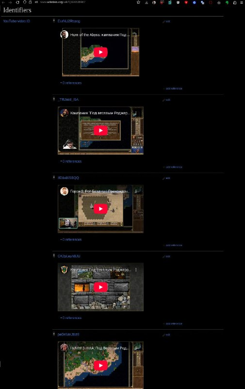

+++
title = "wikidata script to show youtube embeds, spotify, facebook and others"
date = 2025-10-20T13:44:34+00:00
description = "wikidata script to show youtube embeds, spotify, facebook and others Example item from the screenshot"

[taxonomies]
tags = ["wikidata", "youtube", "spotify", "facebook"]

[extra]
tg_url = "https://t.me/vitaly_zdanevich_chan/709"
og_image = "5454198108020933187_1269904456_456262211.jpg"
next_id = 710
next_title = "Король и Шут (сериал)"
prev_id = 708
prev_title = "Not my photo."
views = 31
ids = [709]
+++

{{ tag(t="wikidata") }} script to show {{ tag(t="youtube") }} embeds, {{ tag(t="spotify") }}, {{ tag(t="facebook") }} and others

<https://www.wikidata.org/wiki/User:Lectrician1/embeds.js>

Example item from the screenshot <https://www.wikidata.org/wiki/Q136539967>

