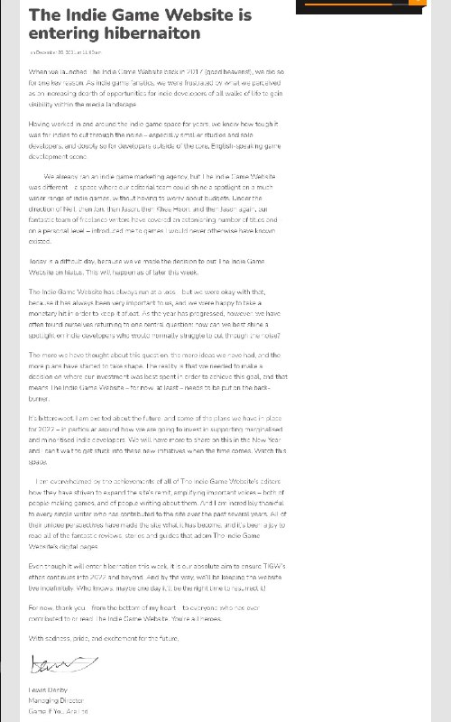

+++
title = ""
date = 2025-10-25T16:55:52+00:00
description = "Downloaded by wget a dying website indiegamewebsite.com The command: wget --mirror --convert-links --adjust-extension --page-requisites --no-parent --no-host-directories Telegram limit is 4GB, to…"

[taxonomies]
days = ["2025-10-25"]
tags = ["wget", "archivation", "games", "website"]

[extra]
id = 720
day = "2025-10-25"
tg_url = "https://t.me/vitaly_zdanevich_chan/720"
og_image = "5472354420839806576_1274131802_456259184.jpg"
next_id = 724
next_title = ""
prev_id = 719
prev_title = ""
views = 40
ids = [720]
+++

Downloaded by {{ tag(t="wget") }} a dying website [indiegamewebsite.com](http://indiegamewebsite.com/)

The command:

```
wget --mirror --convert-links --adjust-extension --page-requisites --no-parent --no-host-directories https://www.indiegamewebsite.com
```

Telegram limit is 4GB, to extract:

```
   cat indiegamewebsite.part.tar.xz.* > indiegamewebsite.tar.xz
   tar -xvJf indiegamewebsite.tar.xz
```

Also published to <https://archive.org/details/indiegamewebsite-com--dump> and <https://drive.google.com/file/d/1K50CPE45llPInA8hlDlFsdDX3aYyqCeY/view>

{{ tag(t="archivation") }}
{{ tag(t="games") }}
{{ tag(t="website") }}


