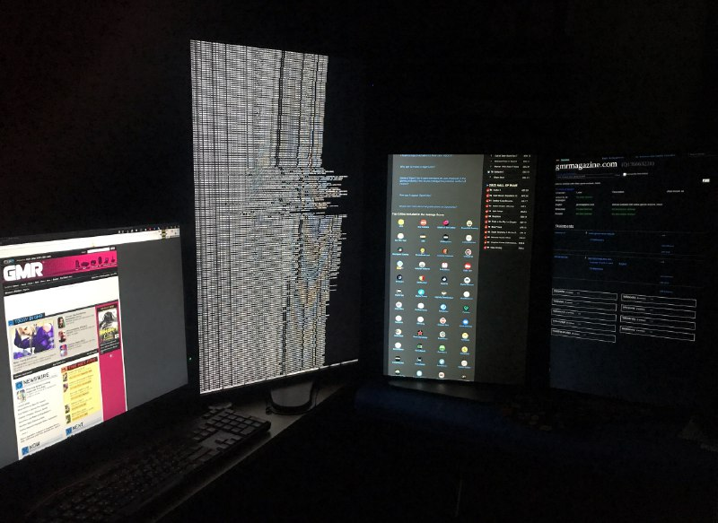

+++
title = "I continue to write my script for importing ratings from metacritic reviewers, creating wikidata items for sites that no longer exists, and trying to download these dead sites from web.archive.org so…"
date = 2025-10-28T23:25:40+00:00
description = "I continue to write my script for importing ratings from metacritic reviewers, creating wikidata items for sites that no longer exists, and trying to download these dead sites from web.archive.org so…"

[taxonomies]
tags = ["metacritic", "wikidata"]

[extra]
tg_url = "https://t.me/vitaly_zdanevich_chan/729"
og_image = "5190885594522320570_1208597234_456261306.jpg"
next_id = 730
next_title = "sakartvelo batumi misha trump"
prev_id = 728
prev_title = "Gamecube-controller-breakdown.jpg"
views = 31
ids = [729]
+++

I continue to write my script for importing ratings from {{ tag(t="metacritic") }} reviewers, creating {{ tag(t="wikidata") }} items for sites that no longer exists, and trying to download these dead sites from [web.archive.org](http://web.archive.org/) so that I can later put them on Gitlab’s free static hosting, because there is no content search on [web.archive.org](http://web.archive.org/)

