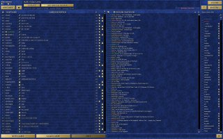

+++
title = ""
date = 2025-11-04T01:15:16+00:00
description = "Heroes of Might and Magic 3: map \"One Bad Day\": hard, 2 people VS AI, defeat No comments. Horn of the Abyss 1.7.1 Playing through Conty on Gentoo Linux no-multilib profile my video game strategy…"

[taxonomies]
days = ["2025-11-04"]
tags = ["my", "video", "game", "strategy", "homm3", "hota", "one_bad_day"]

[extra]
id = 734
day = "2025-11-04"
tg_url = "https://t.me/vitaly_zdanevich_chan/734"
og_image = "01.jpg"
next_id = 735
next_title = ""
prev_id = 733
prev_title = ""
views = 29
ids = [734]
+++

**Heroes of Might and Magic 3: map "One Bad Day": hard, 2 people VS AI, defeat**

No comments.

Horn of the Abyss 1.7.1 <https://h3hota.com/en/documentation>

<https://homm.miraheze.org/wiki/One_Bad_Day_(Allies)>

<https://ru.wikipedia.org/wiki/Heroes_of_Might_and_Magic_III>

<https://www.wikidata.org/wiki/Q136699766>

Playing through Conty on Gentoo Linux no-multilib profile <https://github.com/Kron4ek/Conty>

{{ tag(t="my") }}
{{ tag(t="video") }}
{{ tag(t="game") }}
{{ tag(t="strategy") }}
{{ tag(t="homm3") }}
{{ tag(t="hota") }}
{{ tag(t="one_bad_day") }}

*▶ video — 2:05:02*
