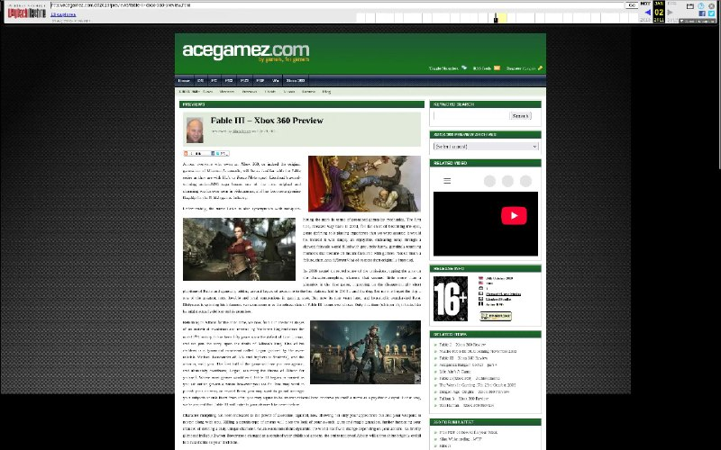

+++
title = ""
date = 2025-11-04T19:46:21+00:00
description = "If WebArchive have it - it still not in Google - you cannot search the website. But you can try to download the website and host it for free on Gitlab/Github. archivation website"

[taxonomies]
days = ["2025-11-04"]
tags = ["archivation", "website"]

[extra]
id = 735
day = "2025-11-04"
tg_url = "https://t.me/vitaly_zdanevich_chan/735"
og_image = "5211094055603867254_1213302383_460000886.jpg"
next_id = 736
next_title = ""
next_body = "#btc lost 20% for one month"
prev_id = 734
prev_title = ""
prev_body = "Heroes of Might and Magic 3: map \"One Bad Day\": hard, 2 people VS AI, defeat\nNo comments.\nHorn of the Abyss 1.7.1\nPlaying through Conty on Gentoo Linux no-multilib profile\n#my\n#video\n#game\n#strategy\n#homm3\n#hota\n#onebadday"
views = 19
ids = [735]
+++

If WebArchive have it - it still not in Google - you cannot search the website. But you can try to download the website and host it for free on Gitlab/Github.  

{{ tag(t="archivation") }}  
{{ tag(t="website") }}

