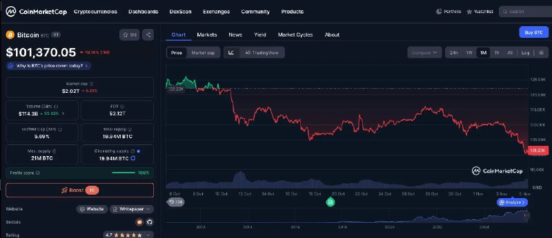

+++
title = "btc lost 20% for one month"
date = 2025-11-05T02:20:44+00:00
description = "btc lost 20% for one month"

[taxonomies]
tags = ["btc"]

[extra]
tg_url = "https://t.me/vitaly_zdanevich_chan/736"
og_image = "5211094055603867521_1213302383_460001153.jpg"
next_id = 737
next_title = "webdesign webdesign_black video"
prev_id = 735
prev_title = "If WebArchive have it - it still not in Google - you cannot search the website."
views = 22
ids = [736]
+++

{{ tag(t="btc") }} lost 20% for one month

