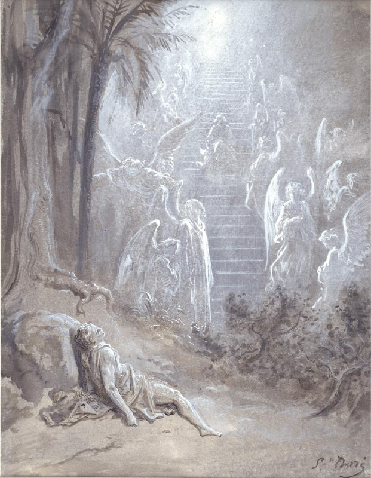

+++
title = "Study for \"Jacob's Dream\""
date = 2025-11-10T04:38:30+00:00
description = "painting bible angel gustavedore Source"

[taxonomies]
tags = ["painting", "bible", "angel", "gustave_dore"]

[extra]
tg_url = "https://t.me/vitaly_zdanevich_chan/754"
og_image = "5229215222705359737_1217521546_460000121.jpg"
next_id = 755
next_title = "The Bible panorama, or The Holy Scriptures in picture and story (1891)"
prev_id = 753
prev_title = "design webdesign webdesign_old xbox"
views = 20
ids = [754]
+++

{{ tag(t="painting") }}
{{ tag(t="bible") }}
{{ tag(t="angel") }}
{{ tag(t="gustave_dore") }}

[Source](https://commons.wikimedia.org/wiki/Category:Art_depicting_the_Old_Testament_by_Gustave_Dor%C3%A9#/media/File:Gustave_Dor%C3%A9_-_Study_for_%22Jacob&#39;s_Dream%22_-_Walters_371319.jpg)

