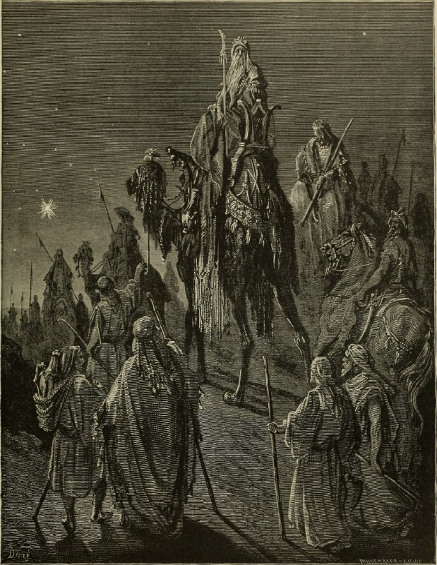

+++
title = "The Bible panorama, or The Holy Scriptures in picture and story (1891)"
date = 2025-11-10T04:45:46+00:00
description = "painting bible gustavedore year1891 Source(14598295740).jpg)"

[taxonomies]
tags = ["painting", "bible", "gustave_dore", "year_1891"]

[extra]
tg_url = "https://t.me/vitaly_zdanevich_chan/755"
og_image = "5229215222705359738_1217521546_460000122.jpg"
next_id = 756
next_title = "The Bible panorama, or The Holy Scriptures in picture and story"
prev_id = 754
prev_title = "Study for \"Jacob's Dream\""
views = 21
ids = [755]
+++

{{ tag(t="painting") }}
{{ tag(t="bible") }}
{{ tag(t="gustave_dore") }}
{{ tag(t="year_1891") }}

[Source](https://commons.wikimedia.org/wiki/File:The_Bible_panorama,_or_The_Holy_Scriptures_in_picture_and_story_(1891)_(14598295740).jpg)

