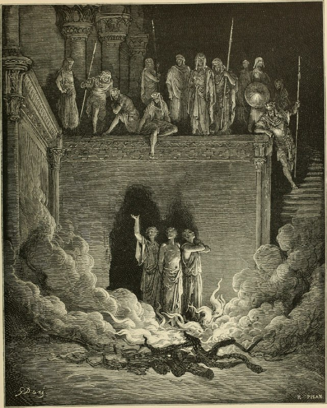

+++
title = "The Bible panorama, or The Holy Scriptures in picture and story"
date = 2025-11-10T04:49:23+00:00
description = "painting bible gustavedore Source(14598336348).jpg)"

[taxonomies]
tags = ["painting", "bible", "gustave_dore"]

[extra]
tg_url = "https://t.me/vitaly_zdanevich_chan/756"
og_image = "5229215222705359739_1217521546_460000123.jpg"
next_id = 757
next_title = "design logo"
prev_id = 755
prev_title = "The Bible panorama, or The Holy Scriptures in picture and story (1891)"
views = 26
ids = [756]
+++

{{ tag(t="painting") }}
{{ tag(t="bible") }}
{{ tag(t="gustave_dore") }}

[Source](https://commons.wikimedia.org/wiki/File:The_Bible_panorama,_or_The_Holy_Scriptures_in_picture_and_story_(1891)_(14598336348).jpg)

