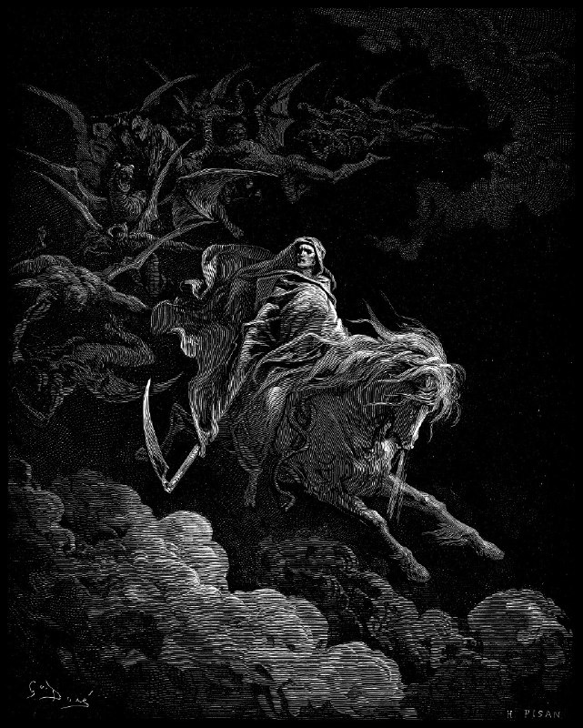

+++
title = "Gustave Dore - Death on the Pale Horse"
date = 2025-11-10T05:13:06+00:00
description = "painting bible gustavedore death horse year1865 Source"

[taxonomies]
tags = ["painting", "bible", "gustave_dore", "death", "horse", "year_1865"]

[extra]
tg_url = "https://t.me/vitaly_zdanevich_chan/760"
og_image = "5229215222705359767_1217521546_460000151.jpg"
next_id = 761
next_title = "Gustave Doré - The Battle of Nicaea.jpg"
prev_id = 759
prev_title = "design artlebedev"
views = 28
ids = [760]
+++

{{ tag(t="painting") }}
{{ tag(t="bible") }}
{{ tag(t="gustave_dore") }}
{{ tag(t="death") }}
{{ tag(t="horse") }}
{{ tag(t="year_1865") }}

[Source](https://commons.wikimedia.org/wiki/File:Gustave_Dore_-_Death_on_the_Pale_Horse.png)

