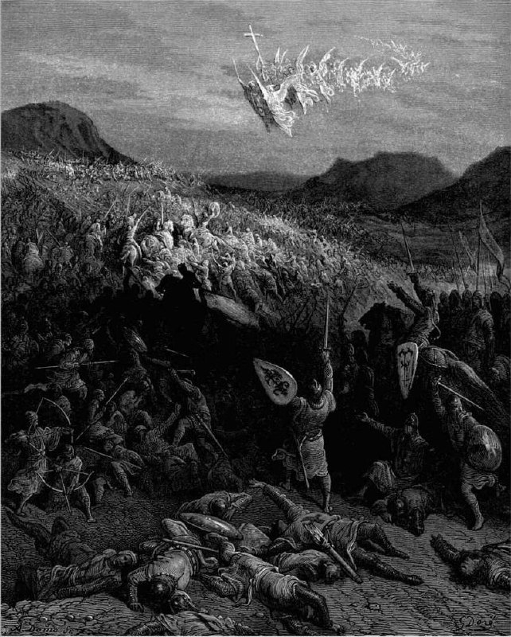

+++
title = ""
date = 2025-11-10T05:55:03+00:00
description = "painting bible gustavedore The Battle of Nicaea Source"

[taxonomies]
days = ["2025-11-10"]
tags = ["painting", "bible", "gustave_dore"]

[extra]
id = 761
day = "2025-11-10"
tg_url = "https://t.me/vitaly_zdanevich_chan/761"
og_image = "5229215222705359837_1217521546_460000221.jpg"
next_id = 762
next_title = ""
next_body = "#painting\n#angel\n#ship\n#gustavedore\nEngraving by Gustave Doré, representing the departure of Aigues-Mortes of Louis IX for the crusade\nSource"
prev_id = 760
prev_title = ""
prev_body = "#painting\n#bible\n#gustavedore\n#death\n#horse\n#year1865\nGustave Dore - Death on the Pale Horse\nSource"
views = 25
ids = [761]
+++

{{ tag(t="painting") }}  
{{ tag(t="bible") }}  
{{ tag(t="gustave_dore") }}  

The Battle of Nicaea

[Source](https://commons.wikimedia.org/wiki/File:Gustave_Dor%C3%A9_-_The_Battle_of_Nicaea.jpg)

