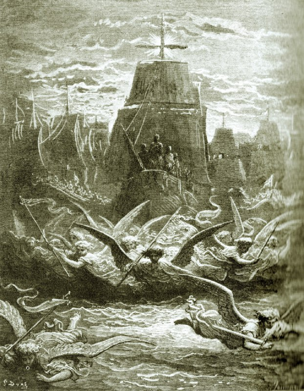

+++
title = "Engraving by Gustave Doré, representing the departure of Aigues-Mortes of Louis IX for the crusade"
date = 2025-11-10T06:00:15+00:00
description = "painting angel ship gustavedore Source"

[taxonomies]
tags = ["painting", "angel", "ship", "gustave_dore"]

[extra]
tg_url = "https://t.me/vitaly_zdanevich_chan/762"
og_image = "5229215222705359841_1217521546_460000225.jpg"
next_id = 763
next_title = "Géraint et Enide sortant de la forêt Pierre noire, lavis brun, rehauts de blanc - 42,2 x 32,2 cm"
prev_id = 761
prev_title = "Gustave Doré - The Battle of Nicaea.jpg"
views = 24
ids = [762]
+++

{{ tag(t="painting") }}
{{ tag(t="angel") }}
{{ tag(t="ship") }}
{{ tag(t="gustave_dore") }}

[Source](https://commons.wikimedia.org/wiki/File:Gustave_Dor%C3%A9,_le_d%C3%A9part_de_Louis_IX_pour_la_croisade.jpg)

