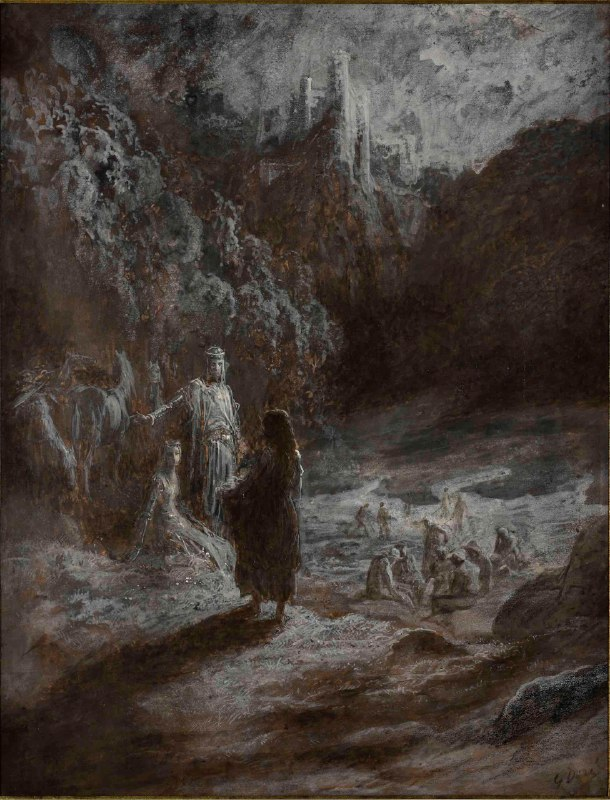

+++
title = ""
date = 2025-11-10T06:15:29+00:00
description = "painting gustavedore Géraint et Enide sortant de la forêt Pierre noire, lavis brun, rehauts de blanc - 42,2 x 32,2 cm"

[taxonomies]
days = ["2025-11-10"]
tags = ["painting", "gustave_dore"]

[extra]
id = 763
day = "2025-11-10"
tg_url = "https://t.me/vitaly_zdanevich_chan/763"
og_image = "5229215222705359857_1217521546_460000241.jpg"
next_id = 764
next_title = ""
next_body = "#painting\n#gustavedore\nSource"
prev_id = 762
prev_title = ""
prev_body = "#painting\n#angel\n#ship\n#gustavedore\nEngraving by Gustave Doré, representing the departure of Aigues-Mortes of Louis IX for the crusade\nSource"
views = 23
ids = [763]
+++

{{ tag(t="painting") }}  
{{ tag(t="gustave_dore") }}  

Géraint et Enide sortant de la forêt Pierre noire, lavis brun, rehauts de blanc - 42,2 x 32,2 cm

