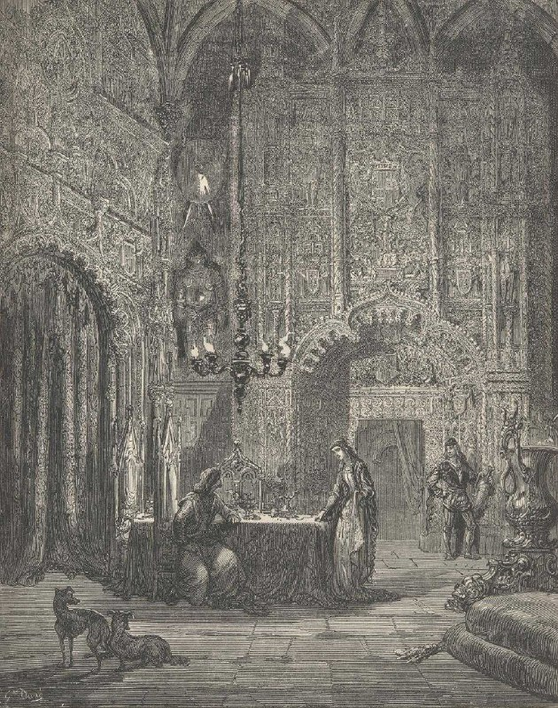

+++
title = "Paul Gustave Louis Christophe Doré V.jpg"
date = 2025-11-10T06:31:15+00:00
description = "Paul Gustave Louis Christophe Doré V.jpg painting gustavedore"

[taxonomies]
tags = ["painting", "gustave_dore"]

[extra]
tg_url = "https://t.me/vitaly_zdanevich_chan/764"
og_image = "5229215222705359874_1217521546_460000258.jpg"
next_id = 765
next_title = "Г. Доре Жена, обчаченная в солнце.jpg"
prev_id = 763
prev_title = "Géraint et Enide sortant de la forêt Pierre noire, lavis brun, rehauts de blanc - 42,2 x 32,2 cm"
views = 30
ids = [764]
+++

[Paul Gustave Louis Christophe Doré V.jpg](https://commons.wikimedia.org/wiki/File:Paul_Gustave_Louis_Christophe_Dor%C3%A9_V.jpg)

{{ tag(t="painting") }}
{{ tag(t="gustave_dore") }}

