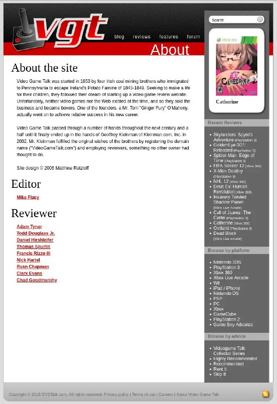

+++
title = ""
date = 2025-11-10T23:23:50+00:00
description = "about gamejournalism webdesign webdesignold Video Game Talk was started in 1853 by four Irish coal mining brothers who immigrated to Pennsylvania to escape Ireland's Potato Famine of 1845-1849.…"

[taxonomies]
days = ["2025-11-10"]
tags = ["about", "game_journalism", "webdesign", "webdesign_old"]

[extra]
id = 766
day = "2025-11-10"
tg_url = "https://t.me/vitaly_zdanevich_chan/766"
og_image = "5228869099880911230_1217440958_460001662.jpg"
next_id = 767
next_title = ""
prev_id = 765
prev_title = ""
views = 36
ids = [766]
+++

{{ tag(t="about") }}
{{ tag(t="game_journalism") }}
{{ tag(t="webdesign") }}
{{ tag(t="webdesign_old") }}

> Video Game Talk was started in 1853 by four Irish coal mining brothers who immigrated to Pennsylvania to escape Ireland's Potato Famine of 1845-1849. Seeking to make a life for their children, they followed their dream of starting up a video game review website. Unfortunately, neither video games nor the Web existed at the time, and so they sold the business and became boxers. One of the founders, a Mr. Tom "Ginger Fury" O'Mahony, actually went on to achieve relative success in his new career.  Video Game Talk passed through a number of hands throughout the next century and a half until it finally ended up in the hands of Geoffrey Kleinman of [Kleinman.com](http://Kleinman.com/), Inc. in 2002. Mr. Kleinman fulfilled the original wishes of the brothers by registering the domain name ("[VideoGameTalk.com](http://VideoGameTalk.com/)") and employing reviewers, something no other owner had thought to do.

<https://web.archive.org/web/20150905154717/http://www.videogametalk.com/about.php>

