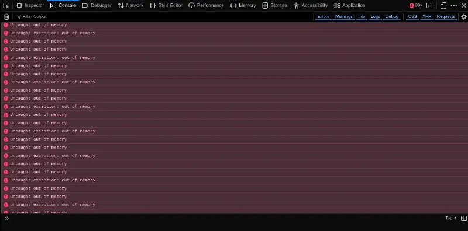

+++
title = ""
date = 2025-11-17T09:20:27+00:00
description = "js Out of memory, but RAM is used to 64% firefox"

[taxonomies]
days = ["2025-11-17"]
tags = ["js", "firefox"]

[extra]
id = 781
day = "2025-11-17"
tg_url = "https://t.me/vitaly_zdanevich_chan/781"
og_image = "5249251099112311939_1222186512_460000387.jpg"
next_id = 782
next_title = ""
next_body = "#ad\n#retro\n#nokia\nSource"
prev_id = 780
prev_title = ""
prev_body = "#webdesign\n#webdesigngames\n#pink"
views = 35
ids = [781]
+++

{{ tag(t="js") }}  

Out of memory, but RAM is used to 64%  

{{ tag(t="firefox") }}

