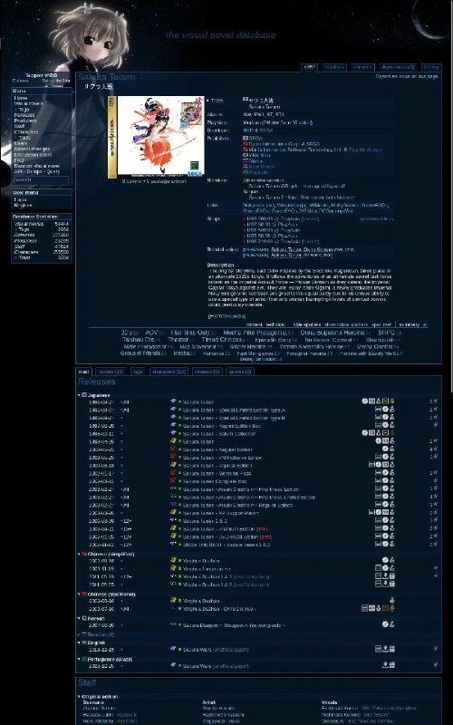

+++
title = ""
date = 2025-11-21T12:59:22+00:00
description = "webdesign webdesigndark webdesigndarkblue webdesigngame visualnovel"

[taxonomies]
days = ["2025-11-21"]
tags = ["webdesign", "webdesign_dark", "webdesign_dark_blue", "webdesign_game", "visual_novel"]

[extra]
id = 788
day = "2025-11-21"
tg_url = "https://t.me/vitaly_zdanevich_chan/788"
og_image = "5262600643447294725_1225294695_460000005.jpg"
next_id = 789
next_title = ""
next_body = "#wikipedia\n#ui\n#navigation"
prev_id = 787
prev_title = ""
prev_body = "#preservation\n#game\n#groundcontrol\n#wwiii\nFrom the game Ground Control) released in 2000\nToday we know only that The Order of the New Dawn was founded by a small coalition of men and women of Faith, who united in common cause during the dark days of the latter 21st century. Foreseeing the coming cataclysm, these early cultists dedicated themselves to preserving as much technology and knowledge as possible, in order to bring about a New Dawn after the inevitable holocaust. Many analysts have observed that without the Sixteen Minutes' War, the Order would have been just another apocalyptic cult.\nBut the End of the Civilized World did indeed come, and the proto-Order was ready for it - and even the corporations, no matter what they may think of the Order in the present day, do not deny the debt all of humanity owes them. The greatest prize saved by the Order was the Liber Aurorae Novae, the Book of the New Dawn: millions of digitally stored books, recordings, and images, which members of…"
views = 41
ids = [788]
+++

{{ tag(t="webdesign") }}  
{{ tag(t="webdesign_dark") }}  
{{ tag(t="webdesign_dark_blue") }}  
{{ tag(t="webdesign_game") }}  
{{ tag(t="visual_novel") }}  

<https://vndb.org/v952>

