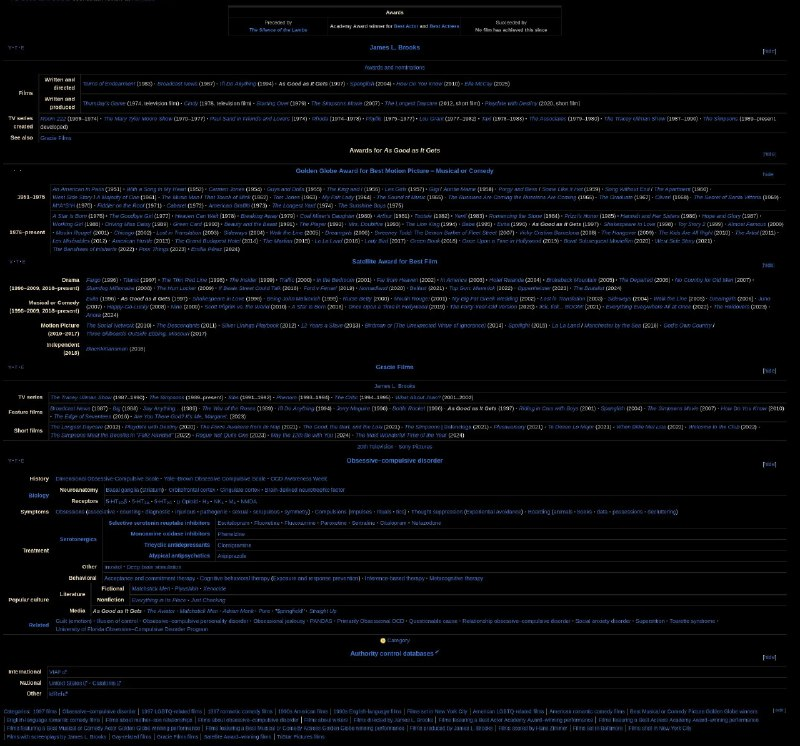

+++
title = "As Good as It Gets"
date = 2025-11-23T14:58:29+00:00
description = "As Good as It Gets wikipedia ui navigation"

[taxonomies]
tags = ["wikipedia", "ui", "navigation"]

[extra]
tg_url = "https://t.me/vitaly_zdanevich_chan/789"
og_image = "5267041880149527904_1226328751_460000608.jpg"
next_id = 790
next_title = "game strategy video review ground_control year_2000"
prev_id = 788
prev_title = "webdesign webdesign_dark webdesign_dark_blue webdesign_game visual_novel"
views = 40
ids = [789]
+++

[As Good as It Gets](https://en.wikipedia.org/wiki/As_Good_as_It_Gets)

{{ tag(t="wikipedia") }}
{{ tag(t="ui") }}
{{ tag(t="navigation") }}

