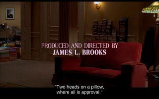

+++
title = "Фильм \"Лучше не бывает\": несколько минут в разных русских озвучках"
date = 2025-12-02T22:06:52+00:00
description = "Обратил внимание как отличается перевод/озвучка. film asgoodasitgets translation russian"

[taxonomies]
tags = ["film", "as_good_as_it_gets", "translation", "russian"]

[extra]
tg_url = "https://t.me/vitaly_zdanevich_chan/795"
og_image = "01.jpg"
next_id = 796
next_title = "Дом со щуками"
prev_id = 794
prev_title = "wikipedia delitionism"
views = 60
ids = [795]
+++

Обратил внимание как отличается перевод/озвучка.

[https://ru.wikipedia.org/wiki/Лучше\_не\_бывает](https://ru.wikipedia.org/wiki/%D0%9B%D1%83%D1%87%D1%88%D0%B5_%D0%BD%D0%B5_%D0%B1%D1%8B%D0%B2%D0%B0%D0%B5%D1%82)

{{ tag(t="film") }}
{{ tag(t="as_good_as_it_gets") }}
{{ tag(t="translation") }}
{{ tag(t="russian") }}

*▶ video — 30:47*
