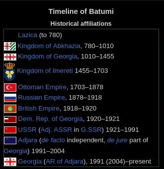

+++
title = ""
date = 2025-12-21T06:58:09+00:00
description = "history batumi countries"

[taxonomies]
days = ["2025-12-21"]
tags = ["history", "batumi", "countries"]

[extra]
id = 804
day = "2025-12-21"
tg_url = "https://t.me/vitaly_zdanevich_chan/804"
og_image = "5350606245624220539_1245785096_460000123.jpg"
next_id = 805
next_title = ""
next_body = "#anime\n#logo\n#mascon\n#design"
prev_id = 802
prev_title = ""
prev_body = "Love this #logo"
views = 33
ids = [804]
+++

<https://en.wikipedia.org/wiki/Batumi>  

{{ tag(t="history") }}  
{{ tag(t="batumi") }}  
{{ tag(t="countries") }}

