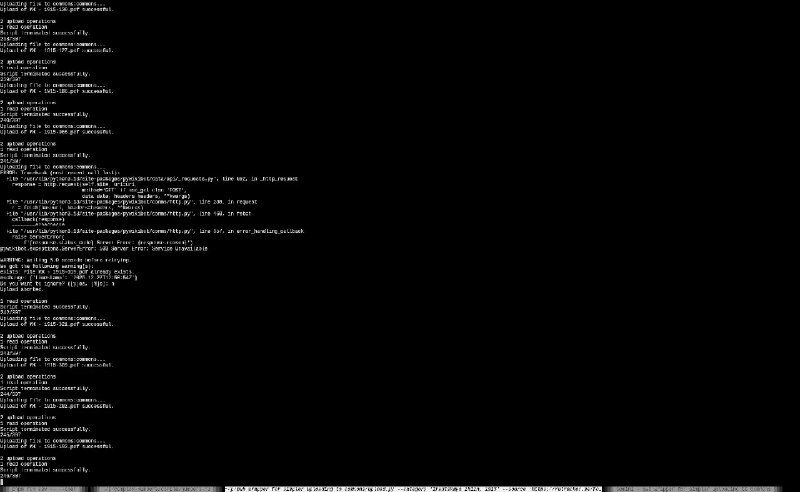

+++
title = ""
date = 2025-12-27T12:53:20+00:00
description = "preservation wikimediacommons pywikibot my Created a new tool: python wrapper for Pywikibot to make uploading to Wikimedia Commons from cli simpler"

[taxonomies]
days = ["2025-12-27"]
tags = ["preservation", "wikimedia_commons", "pywikibot", "my", "python", "cli"]

[extra]
id = 819
day = "2025-12-27"
tg_url = "https://t.me/vitaly_zdanevich_chan/819"
og_image = "5368708261466541835_1249999800_460001035.jpg"
next_id = 820
next_title = ""
prev_id = 818
prev_title = ""
views = 26
ids = [819]
+++

{{ tag(t="preservation") }}
{{ tag(t="wikimedia_commons") }}
{{ tag(t="pywikibot") }}
{{ tag(t="my") }}

Created a new tool: {{ tag(t="python") }} wrapper for [Pywikibot](https://github.com/wikimedia/pywikibot) to make uploading to [Wikimedia Commons](https://commons.wikimedia.org/wiki/Main_Page) from {{ tag(t="cli") }} simpler

<https://gitlab.com/vitaly-zdanevich/pwb_wrapper_for_simpler_uploading_to_commons>

