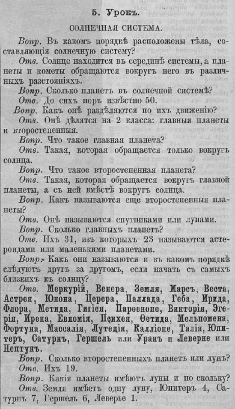

+++
title = ""
date = 2025-12-31T12:16:38+00:00
description = "solarsystem planets year1872 Page 30"

[taxonomies]
days = ["2025-12-31"]
tags = ["solar_system", "planets", "year_1872"]

[extra]
id = 833
day = "2025-12-31"
tg_url = "https://t.me/vitaly_zdanevich_chan/833"
og_image = "5382044023251471194_1253104774_460000090.jpg"
next_id = 834
next_title = ""
next_body = "#botanic\n#botanicillustration\nSourceBHL287631.jpg)"
prev_id = 832
prev_title = ""
prev_body = "#language\nВе́псский язы́к (самоназвание — vepsän kel') — язык вепсов, входящий в северную подветвь прибалтийско-финских языков финно-угорской ветви уральской языковой семьи\nSource"
views = 20
ids = [833]
+++

{{ tag(t="solar_system") }}  
{{ tag(t="planets") }}  
{{ tag(t="year_1872") }}  

[Page 30](https://commons.wikimedia.org/wiki/Category:Zhivopisnoye_obozreniye,_1872)

