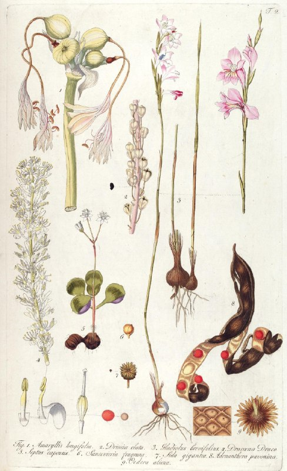

+++
title = ""
date = 2026-01-01T06:44:22+00:00
description = "botanic botanicillustration SourceBHL287631.jpg)"

[taxonomies]
days = ["2026-01-01"]
tags = ["botanic", "botanic_illustration"]

[extra]
id = 834
day = "2026-01-01"
tg_url = "https://t.me/vitaly_zdanevich_chan/834"
og_image = "5384459448434232145_1253667159_460000081.jpg"
next_id = 835
next_title = ""
next_body = "#webdesign\n#petersburg\n#theater"
prev_id = 833
prev_title = ""
prev_body = "#solarsystem\n#planets\n#year1872\nPage 30"
views = 22
ids = [834]
+++

{{ tag(t="botanic") }}  
{{ tag(t="botanic_illustration") }}

[Source](https://commons.wikimedia.org/wiki/File:Fragmenta_botanica,_figuris_coloratis_illustrata_(T._2)_BHL287631.jpg)

