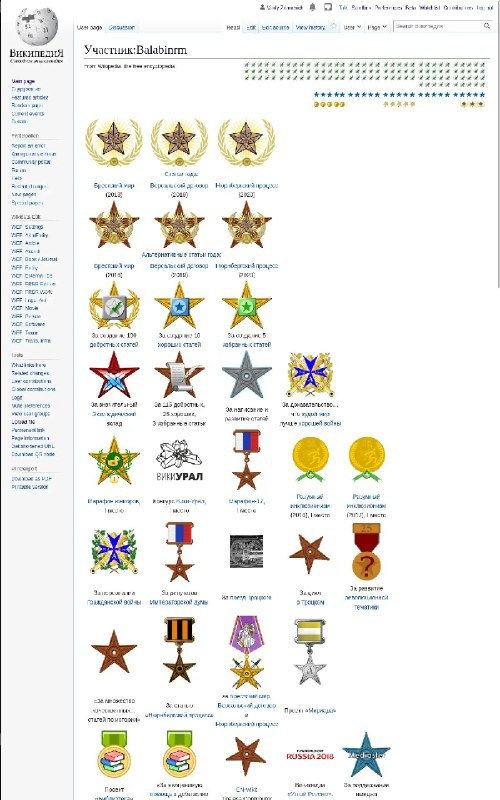

+++
title = ""
date = 2026-01-01T15:14:25+00:00
description = "wikipedia medals awards"

[taxonomies]
days = ["2026-01-01"]
tags = ["wikipedia", "medals", "awards"]

[extra]
id = 836
day = "2026-01-01"
tg_url = "https://t.me/vitaly_zdanevich_chan/836"
og_image = "5384459448434233871_1253667159_460001807.jpg"
next_id = 837
next_title = ""
prev_id = 835
prev_title = ""
views = 23
ids = [836]
+++

{{ tag(t="wikipedia") }}
{{ tag(t="medals") }}
{{ tag(t="awards") }}

[https://ru.wikipedia.org/wiki/Участник:Balabinrm](https://ru.wikipedia.org/wiki/%D0%A3%D1%87%D0%B0%D1%81%D1%82%D0%BD%D0%B8%D0%BA:Balabinrm)

