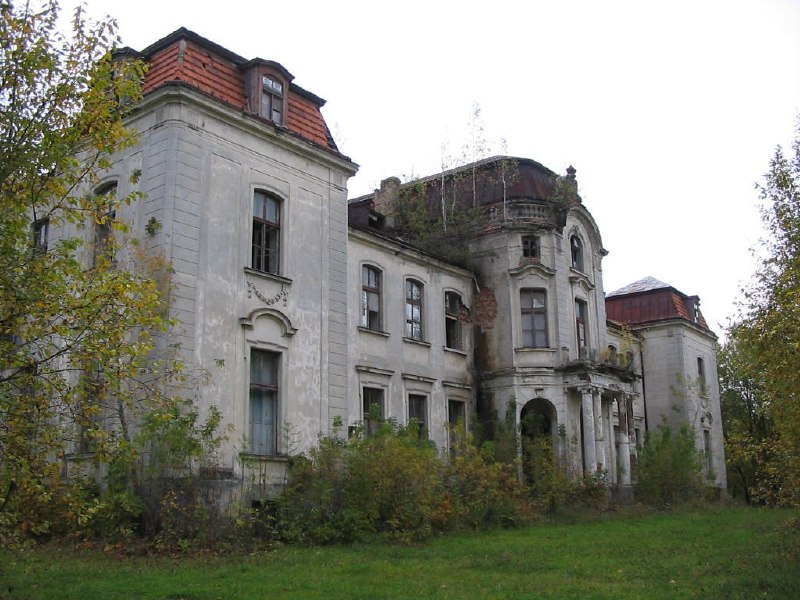

+++
title = ""
date = 2026-01-07T11:00:50+00:00
description = "belarus building castle abandoned globustut Source"

[taxonomies]
days = ["2026-01-07"]
tags = ["belarus", "building", "castle", "abandoned", "globustut"]

[extra]
id = 843
day = "2026-01-07"
tg_url = "https://t.me/vitaly_zdanevich_chan/843"
og_image = "5399816645166960855_1257242785_460001495.jpg"
next_id = 844
next_title = ""
next_body = "#belarus\n#building\n#castle\n#abandoned\n#globustut\nSource"
prev_id = 842
prev_title = ""
prev_body = ""
views = 16
ids = [843]
+++

{{ tag(t="belarus") }}  
{{ tag(t="building") }}  
{{ tag(t="castle") }}  
{{ tag(t="abandoned") }}  
{{ tag(t="globustut") }}  

[Source](https://commons.wikimedia.org/wiki/File:022-384_%D0%96%D0%B5%D0%BB%D1%83%D0%B4%D0%BE%D0%BA,_09-10-2004.jpg)

