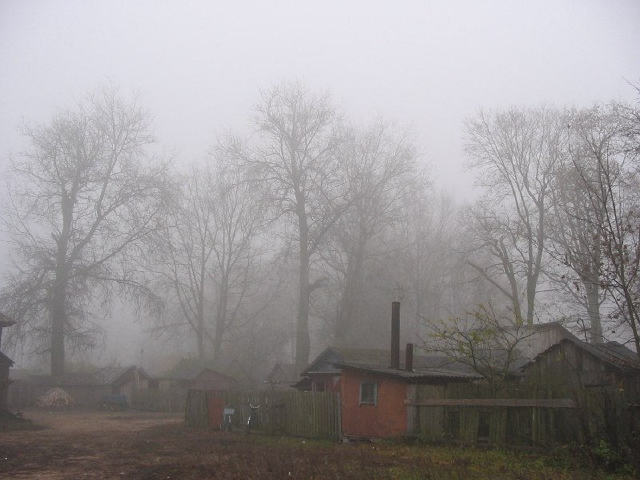

+++
title = "025-066 Габриелевка, 30-10-2004.jpg"
date = 2026-01-07T18:13:32+00:00
description = "025-066 Габриелевка, 30-10-2004.jpg photo belarus globustut village"

[taxonomies]
tags = ["photo", "belarus", "globustut", "village"]

[extra]
tg_url = "https://t.me/vitaly_zdanevich_chan/849"
og_image = "5402068444980645556_1257767073_460000948.jpg"
next_id = 850
next_title = "025-247 Грозов, 30-10-2004.jpg"
prev_id = 844
prev_title = "022-466 Дикушки, 09-10-2004.jpg"
views = 12
ids = [849]
+++

[025-066 Габриелевка, 30-10-2004.jpg](https://commons.wikimedia.org/wiki/File:025-066_%D0%93%D0%B0%D0%B1%D1%80%D0%B8%D0%B5%D0%BB%D0%B5%D0%B2%D0%BA%D0%B0,_30-10-2004.jpg)

{{ tag(t="photo") }}
{{ tag(t="belarus") }}
{{ tag(t="globustut") }}
{{ tag(t="village") }}

