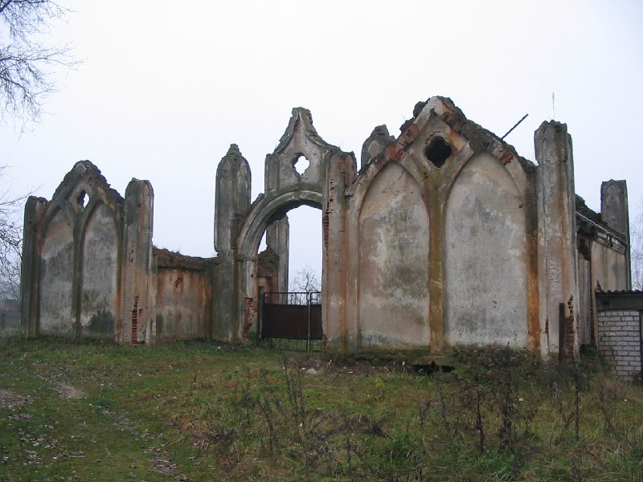

+++
title = ""
date = 2026-01-07T19:30:48+00:00
description = "belarus building abandoned globustut Source"

[taxonomies]
days = ["2026-01-07"]
tags = ["belarus", "building", "abandoned", "globustut"]

[extra]
id = 852
day = "2026-01-07"
tg_url = "https://t.me/vitaly_zdanevich_chan/852"
og_image = "5402068444980645854_1257767073_460001246.jpg"
next_id = 853
next_title = ""
next_body = "#belarus\n#grandmother\n#globustut\nSource"
prev_id = 851
prev_title = ""
prev_body = "#belarus\n#building\n#abandoned\n#globustut\nSource"
views = 13
ids = [852]
+++

{{ tag(t="belarus") }}  
{{ tag(t="building") }}  
{{ tag(t="abandoned") }}  
{{ tag(t="globustut") }}  

[Source](https://commons.wikimedia.org/wiki/File:025-425_%D0%9D%D0%B0%D0%B4%D0%BD%D0%B5%D0%BC%D0%B0%D0%BD,_30-10-2004.jpg)

