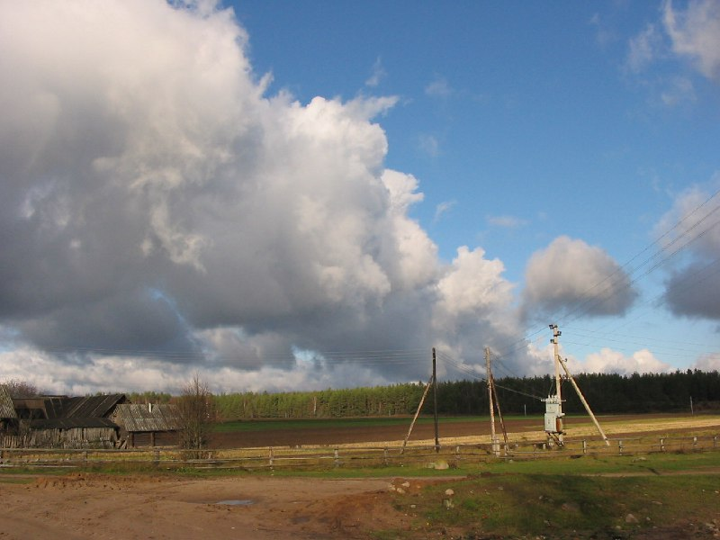

+++
title = "026-022 близ Бегомль, 02-11-2004.jpg"
date = 2026-01-07T21:37:19+00:00
description = "026-022 близ Бегомль, 02-11-2004.jpg belarus nature village"

[taxonomies]
tags = ["belarus", "nature", "village", "globustut"]

[extra]
tg_url = "https://t.me/vitaly_zdanevich_chan/854"
og_image = "5402068444980646165_1257767073_460001557.jpg"
next_id = 855
next_title = "026-056 Бегомль, 02-11-2004.jpg"
prev_id = 853
prev_title = "026-004 Плещеницы, 02-11-2004.jpg"
views = 17
ids = [854]
+++

[026-022 близ Бегомль, 02-11-2004.jpg](https://commons.wikimedia.org/wiki/File:026-022_%D0%B1%D0%BB%D0%B8%D0%B7_%D0%91%D0%B5%D0%B3%D0%BE%D0%BC%D0%BB%D1%8C,_02-11-2004.jpg)

{{ tag(t="belarus") }}
{{ tag(t="nature") }}
{{ tag(t="village") }}

