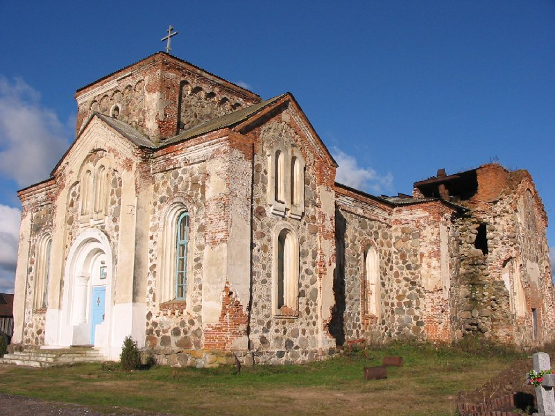

+++
title = "026-056 Бегомль, 02-11-2004.jpg"
date = 2026-01-07T21:39:47+00:00
description = "026-056 Бегомль, 02-11-2004.jpg belarus church"

[taxonomies]
tags = ["belarus", "church", "globustut"]

[extra]
tg_url = "https://t.me/vitaly_zdanevich_chan/855"
og_image = "5402068444980646167_1257767073_460001559.jpg"
next_id = 856
next_title = "027-418 Полоцк, 04-11-2004.jpg"
prev_id = 854
prev_title = "026-022 близ Бегомль, 02-11-2004.jpg"
views = 16
ids = [855]
+++

[026-056 Бегомль, 02-11-2004.jpg](https://commons.wikimedia.org/wiki/File:026-056_%D0%91%D0%B5%D0%B3%D0%BE%D0%BC%D0%BB%D1%8C,_02-11-2004.jpg)

{{ tag(t="belarus") }}
{{ tag(t="church") }}

