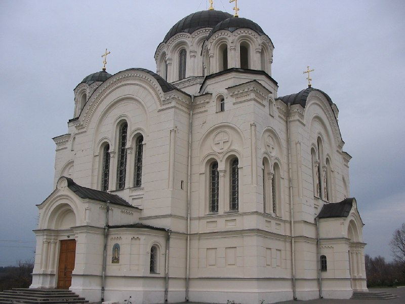

+++
title = ""
date = 2026-01-08T09:19:08+00:00
description = "belarus polotsk church globustut Source"

[taxonomies]
days = ["2026-01-08"]
tags = ["belarus", "polotsk", "church", "globustut"]

[extra]
id = 856
day = "2026-01-08"
tg_url = "https://t.me/vitaly_zdanevich_chan/856"
og_image = "5404320244794329923_1258291361_460000067.jpg"
next_id = 857
next_title = ""
next_body = "#belarus\n#minsk\n1941-1944\nSource"
prev_id = 855
prev_title = ""
prev_body = "#belarus\n#church\n#globustut\nSource"
views = 16
ids = [856]
+++

{{ tag(t="belarus") }}  
{{ tag(t="polotsk") }}  
{{ tag(t="church") }}  
{{ tag(t="globustut") }}  

[Source](https://commons.wikimedia.org/wiki/File:027-418_%D0%9F%D0%BE%D0%BB%D0%BE%D1%86%D0%BA,_04-11-2004.jpg)

