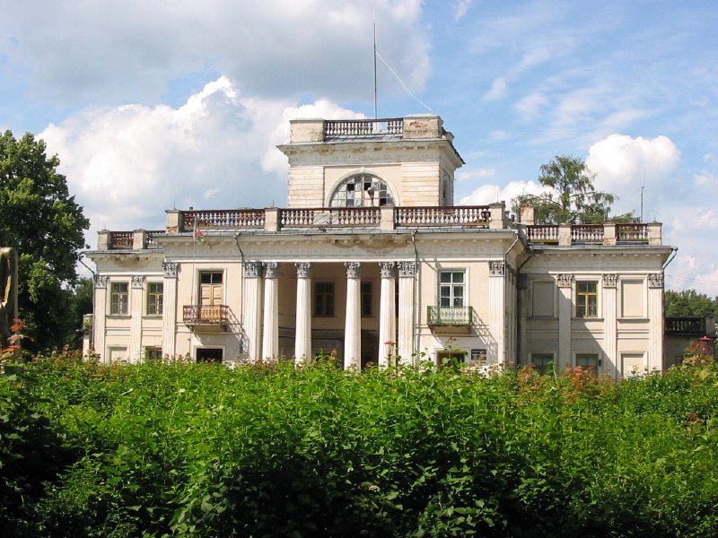

+++
title = "Globustut 295 Жемыславль.jpg"
date = 2026-01-08T20:56:42+00:00
description = "Globustut 295 Жемыславль.jpg belarus building globustut"

[taxonomies]
tags = ["belarus", "building", "globustut"]

[extra]
tg_url = "https://t.me/vitaly_zdanevich_chan/863"
og_image = "5404782293081068322_1258398940_460002082.jpg"
next_id = 864
next_title = "Globustut 409 Липнишки.jpg"
prev_id = 862
prev_title = "Globustut 283 Жемыславль.jpg"
views = 15
ids = [863]
+++

[Globustut 295 Жемыславль.jpg](https://commons.wikimedia.org/wiki/File:Globustut_295_%D0%96%D0%B5%D0%BC%D1%8B%D1%81%D0%BB%D0%B0%D0%B2%D0%BB%D1%8C.jpg)

{{ tag(t="belarus") }}
{{ tag(t="building") }}
{{ tag(t="globustut") }}

