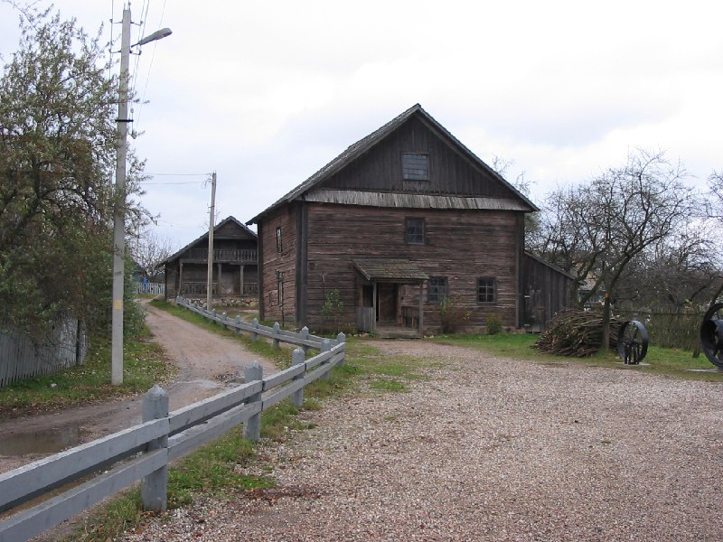

+++
title = ""
date = 2026-01-08T21:07:00+00:00
description = "belarus building globustut Source"

[taxonomies]
days = ["2026-01-08"]
tags = ["belarus", "building", "globustut"]

[extra]
id = 865
day = "2026-01-08"
tg_url = "https://t.me/vitaly_zdanevich_chan/865"
og_image = "5404782293081068336_1258398940_460002096.jpg"
next_id = 866
next_title = ""
next_body = "#belarus\n#building\n#globustut\nSource"
prev_id = 864
prev_title = ""
prev_body = "#belarus\n#building\n#globustut\nSource"
views = 16
ids = [865]
+++

{{ tag(t="belarus") }}  
{{ tag(t="building") }}  
{{ tag(t="globustut") }}  

[Source](https://commons.wikimedia.org/wiki/File:028-189_%D0%97%D0%B0%D1%81%D0%BB%D0%B0%D0%B2%D0%BB%D1%8C,_06-11-2004.jpg)

