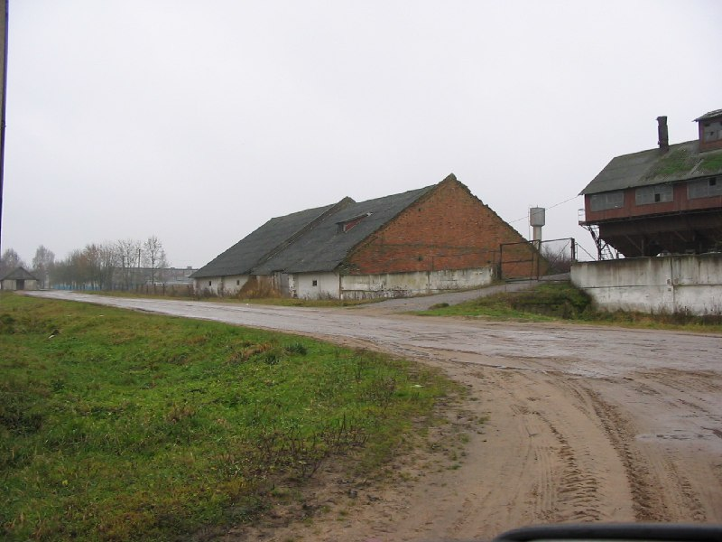

+++
title = ""
date = 2026-01-08T23:23:30+00:00
description = "belarus building globustut year2004 Source"

[taxonomies]
days = ["2026-01-08"]
tags = ["belarus", "building", "globustut", "year_2004"]

[extra]
id = 867
day = "2026-01-08"
tg_url = "https://t.me/vitaly_zdanevich_chan/867"
og_image = "5407034092894751538_1258923228_460000050.jpg"
next_id = 868
next_title = ""
next_body = "#belarus\n#building\n#globustut\n#year2004\nSource"
prev_id = 866
prev_title = ""
prev_body = "#belarus\n#building\n#globustut\nSource"
views = 16
ids = [867]
+++

{{ tag(t="belarus") }}  
{{ tag(t="building") }}  
{{ tag(t="globustut") }}  
{{ tag(t="year_2004") }}  

[Source](https://commons.wikimedia.org/wiki/File:029-074_%D0%9B%D1%8E%D0%B1%D0%B0%D0%BD%D1%8C,_%D1%83%D1%81%D0%B0%D0%B4%D1%8C%D0%B1%D0%B0,_13-11-2004.jpg)

