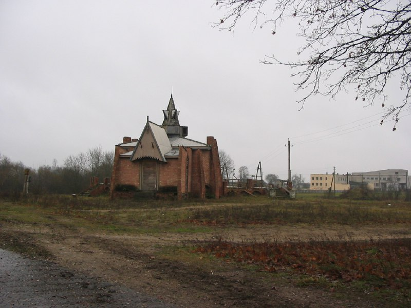

+++
title = "029-152 Лыцевичи, 13-11-2004.jpg"
date = 2026-01-08T23:25:13+00:00
description = "029-152 Лыцевичи, 13-11-2004.jpg belarus building globustut year2004"

[taxonomies]
tags = ["belarus", "building", "globustut", "year_2004"]

[extra]
tg_url = "https://t.me/vitaly_zdanevich_chan/868"
og_image = "5407034092894751539_1258923228_460000051.jpg"
next_id = 869
next_title = "029-268 Шеметово, 13-11-2004.jpg"
prev_id = 867
prev_title = "029-074 Любань, усадьба, 13-11-2004.jpg"
views = 17
ids = [868]
+++

[029-152 Лыцевичи, 13-11-2004.jpg](https://commons.wikimedia.org/wiki/File:029-152_%D0%9B%D1%8B%D1%86%D0%B5%D0%B2%D0%B8%D1%87%D0%B8,_13-11-2004.jpg)

{{ tag(t="belarus") }}
{{ tag(t="building") }}
{{ tag(t="globustut") }}
{{ tag(t="year_2004") }}

